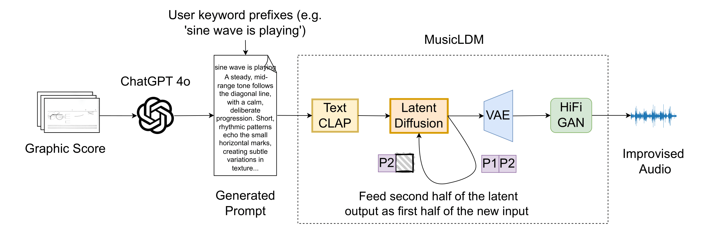

# 🎼 Interpreting Graphic Notation with MusicLDM  
**An AI Improvisation of Cornelius Cardew’s Treatise**  
_Tornike Karchkhadze, Keren Shao, Shlomo Dubnov_  
📍 IEEE Big Data 2024 · 🏆 AI music Award  

[](https://colab.research.google.com/github/karchkha/Treatise-AI-Music/blob/main/treatise_ai.ipynb)

---

## 🔗 Links

- 📝 [Read the full paper (IEEE Big Data 2024)](https://ieeexplore.ieee.org/document/10825824)  
- 📝 [Read the full paper Arxiv](https://arxiv.org/abs/2412.08944) 
- 🏆 [Wiew the Award](https://music-cms.ucsd.edu/_images/news_images/2024-12_shlomo_award_pdf)
- 🎧 [Listen to generated music](https://soundcloud.com/memexguy/sets/cornelius-cardews-treatise-interpreted-by-ai-visual-chatgpt-music-latent-diffusion)  
- 📺 [Watch selected Treatise interpretations](https://youtube.com/playlist?list=PLFBnJMS2Dk5z6l5YWBRPjRmwRHMU7mEHd&si=I0CcBXW1CBXFz8H_)

---

## 🎨 Project Overview

This project presents a novel AI-based approach for composing and improvising music from graphic scores—specifically, Cornelius Cardew’s *Treatise*. Using a pipeline that combines **ChatGPT** (for interpreting visual elements into text) and **MusicLDM** (for generating music from these descriptions), we offer a new perspective on the interpretation of abstract, open-ended scores.

  
<sup><b>Figure:</b> Graphic scores are converted into text using ChatGPT-4, then translated into sound using MusicLDM. The outpainting technique ensures smooth stitching across musical segments.</sup>

---

## 🧠 Method Summary

**1. Visual Interpretation (ChatGPT 4o)**  
Images from *Treatise* are interpreted into creative prompts using ChatGPT-4o's multimodal vision model.

**2. Sound Generation (MusicLDM)**  
The prompts are passed into MusicLDM, a latent diffusion model trained for music generation, producing short musical segments.

**3. Outpainting for Seamless Composition**  
We introduce an "outpainting" strategy—overlapping the tail of one generated segment with the head of the next—to create a continuous musical flow.

---

## 🚀 Try It Yourself

You can run this project in two ways:

---

### 🖥️ Option 1: Run Locally (GPU Required)

If you have access to a GPU machine (preferably with **at least 8 GB VRAM**), you can run the model directly from this repository.

#### 1. Clone the repo:
```bash
git clone https://github.com/karchkha/Treatise-AI-Music.git
cd Treatise-AI-Music
```

#### 2. Prepare your prompts:
You’ll need a list of sentences that describe the music you'd like to generate.  
You can either:
- Write your own,
- Or upload graphic notation images (e.g., from *Treatise*) to **ChatGPT** and ask it to describe them in words.

Save your sentence prompts in a plain text file (one sentence per line).  
Two example files are included in this repo:
- `treatise_commands.txt`
- `treatise_commands_all.txt`

#### 3. Run the generation script:
```bash
python infer_musicldm_continuous.py --texts treatise_commands.txt
```

This will generate audio clips and save them in `lightning_logs/musicldm_inference_logs/`.

---

### 🔗 Option 2: Use Google Colab

Just click below to open our interactive notebook in Colab:

[](https://colab.research.google.com/github/karchkha/Treatise-AI-Music/blob/main/treatise_ai.ipynb)

In the Colab notebook, you'll be guided through:
- Installing dependencies
- Uploading or selecting a prompt file
- Running the MusicLDM generation
- Listening to the generated music directly in your browser

---


### 🤝 Acknowledgments

This project was supported by:

- [IRCAM](https://www.ircam.fr/) – Institute for Research and Coordination in Acoustics and Music  
- **Project REACH: Raising Co-creativity in Cyber-Human Musicianship**, funded by the European Research Council (ERC) under the EU’s Horizon 2020 research and innovation programme (Grant Agreement No. 883313)

We also thank **Wilfrido Terrazas**, Associate Professor of Music at the University of California, San Diego, for his inspiration, improvisation materials, and valuable feedback.

---

### ⚠️ License and Credits

This project builds upon [**MusicLDM**](https://github.com/RetroCirce/MusicLDM) by **Ke Chen, Yusong Wu, and Haohe Liu**:

> *MusicLDM: Enhancing Novelty in Text-to-Music Generation Using Beat-Synchronous Mixup Strategies*

MusicLDM is released under the [Creative Commons Attribution-NonCommercial 4.0 International License (CC BY-NC 4.0)](https://creativecommons.org/licenses/by-nc/4.0/legalcode).

This repository is intended for **research and educational purposes only**. Please respect the original license when using or modifying any part of this code.


## ✨ Citation

If you use this work in academic contexts, please cite:

```bibtex
@inproceedings{karchkhadze2024interpreting,
  title={Interpreting Graphic Notation with MusicLDM: An AI Improvisation of Cornelius Cardew’s Treatise},
  author={Karchkhadze, Tornike and Shao, Keren and Dubnov, Shlomo},
  booktitle={2024 IEEE International Conference on Big Data (BigData)},
  pages={3181--3190},
  year={2024},
  organization={IEEE}
}
